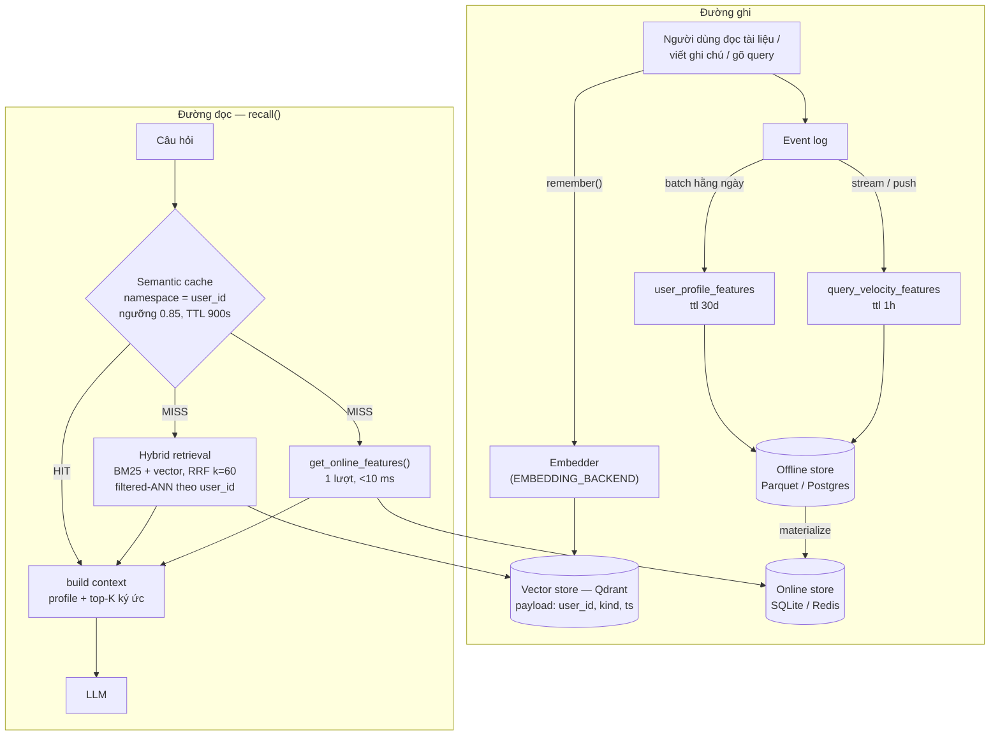

# Hybrid Memory — kiến trúc bộ nhớ cho trợ lý AI cá nhân (tiếng Việt)

**Bonus challenge, Lab 19 Track 2.** POC chạy được: `python bonus/demo.py`.
Code: [`bonus/agent.py`](agent.py) · [`bonus/demo.py`](demo.py).

Trợ lý cần nhớ ba thứ có **chu kỳ thay đổi khác nhau ba bậc độ lớn**, và chính
sự khác nhau đó — chứ không phải "vector store thì hay" — là lý do kiến trúc
tách làm hai kho.

| Loại ký ức | Ví dụ | Ghi mới | Đọc |
|---|---|---|---|
| Episodic (tình tiết) | hội thoại cũ, tài liệu đã đọc, ghi chú | vài lần/giờ | ANN top-K |
| Profile ổn định | ngôn ngữ ưa dùng, tốc độ đọc, chủ đề quan tâm | vài lần/tuần | key lookup |
| Hoạt động gần đây | query 1 giờ qua, số chủ đề 24h | liên tục | key lookup |

---

## 1. Sơ đồ

Hai kho trả lời **hai câu hỏi khác nhau**: vector store trả lời *"cái gì liên
quan"*, feature store trả lời *"người này là ai"*. Ghép ở bước cuối, đúng như
`build_context()` của NB6.

---

## 2. Ba quyết định kiến trúc

### Quyết định 1 — Chunking: **một ký ức = một đơn vị ngữ nghĩa do người dùng tạo ra**, không phải per-message, không phải cắt theo token

*Ba phương án đã cân nhắc:*

| | Chất lượng truy xuất | Chi phí lưu | Ngân sách context |
|---|---|---|---|
| **Per-message** | tệ — "ok em", "cảm ơn" cũng thành vector, nhiễu ngập top-K | cao nhất (×5–10 số vector) | mỗi mảnh nhỏ nên nhét được nhiều, nhưng phần lớn là rác |
| **Per-conversation** | tệ theo chiều ngược lại — một hội thoại 40 lượt bàn 5 chủ đề, embedding rơi vào *khoảng giữa*, không gần chủ đề nào (đúng hiện tượng NB6 đo được ở câu hỏi ghép) | thấp | mỗi hit chiếm cả nghìn token |
| **Đơn vị ngữ nghĩa** (đã chọn) | mỗi chunk có **một** ý định | trung bình | hit ngắn, ghép được 5 cái vẫn dưới ngân sách |

Chọn phương án 3: một "ký ức" = một tài liệu đã đọc, một ghi chú, hoặc một
**đoạn hội thoại đã bị cắt tại điểm chuyển chủ đề** (cosine giữa hai lượt liên
tiếp tụt dưới ngưỡng → cắt), trần cứng ~512 token để không có chunk khổng lồ.
Đánh đổi phải trả: cắt theo ngữ nghĩa cần thêm một lượt embedding lúc **ghi**,
và ghi thì nhiều hơn đọc ở giai đoạn đầu — chấp nhận, vì chi phí đó là một lần
còn recall tồi thì trả mãi mãi.

### Quyết định 2 — Feature schema: **tabular trước, embedding feature sau**

| Feature | Entity | TTL | Nguồn | Vì sao |
|---|---|---|---|---|
| `preferred_language` (vi/en/mix) | user | 30d | batch, thống kê ngôn ngữ 30 ngày | quyết định ngôn ngữ trả lời |
| `reading_speed_wpm` | user | 30d | batch, dwell time / độ dài tài liệu | quyết định độ dài tóm tắt |
| `topic_affinity` | user | 30d | batch, argmax topic 30 ngày | boost re-rank, chọn `topic` filter |
| `queries_last_hour` | user | 1h | **stream** | phát hiện phiên làm việc đang sôi động |
| `distinct_topics_24h` | user | 1h | **stream** | phân biệt "đào sâu" với "lướt" |

Phương án thay thế là **embedding feature**: nhét thẳng vector "sở thích tiềm
ẩn" (trung bình các doc đã đọc) vào feature view. Mạnh hơn về biểu diễn, nhưng
đổi lại: (a) không debug được — không ai giải thích nổi vì sao chiều thứ 214
đổi dấu; (b) **đổi embedding model là phải backfill toàn bộ feature store**, tức
là buộc chu kỳ re-index của vector store vào chu kỳ của feature store, đúng thứ
mà kiến trúc này cố tách ra. POC dùng tabular, và để dành embedding feature cho
bước re-rank ở tầng ứng dụng — chỗ có thể bỏ đi mà không phải migrate dữ liệu.

Mọi feature đều đọc qua **point-in-time join** khi train (NB8 đo được: latest-value
join làm AUC offline cao hơn thực tế vì kéo giá trị ghi *sau* nhãn), và qua
`get_online_features()` khi serve — cùng một định nghĩa, hết training-serving skew.

### Quyết định 3 — Freshness: **ba đường, chọn theo hậu quả của việc trả lời cũ**

| Use case | Yêu cầu | Đường đi | Vì sao không nhanh hơn / chậm hơn |
|---|---|---|---|
| "Tôi vừa đọc xong bài này, tóm tắt giúp" | **sub-second** | ghi thẳng vào vector store trong `remember()` (không qua batch) | trả lời "tôi chưa biết bài đó" ngay sau khi user vừa đọc là hỏng rõ ràng nhất |
| "Dạo này tôi tập trung vào gì" | **~5 phút** | streaming push vào `query_velocity_features` | user không đo được chênh lệch 5 phút; đổi lại không cần một pipeline đúng-tới-từng-giây |
| "Chủ đề tôi quan tâm nhất" | **hằng ngày** | batch materialize | `topic_affinity` là trung bình 30 ngày — cập nhật mỗi giờ cũng ra gần đúng con số cũ, chỉ tốn tiền |

Nguyên tắc: freshness là **chi phí**, không phải chất lượng. Chỉ trả tiền ở chỗ
người dùng nhìn thấy độ trễ.

---

## 3. Phương án đã bác bỏ (nêu rõ)

**Đã cân nhắc: lưu episodic memory ngay trong feature store như một embedding
feature view, bỏ hẳn vector store.** Bác bỏ, vì:

1. **Truy vấn sai hình dạng.** Feature store được xây cho *key lookup* —
   "cho tôi feature của `u_001`". Episodic memory cần *ANN top-K theo độ tương
   tự*, thứ mà online store (SQLite/Redis key-value) không làm được. Sẽ phải
   quét toàn bộ ký ức của user rồi tính cosine ở tầng ứng dụng — chính là
   `pre_filter` của NB5: luôn đúng, nhưng vứt bỏ index.
2. **Chu kỳ re-index khác nhau.** Ký ức mới sinh ra vài lần mỗi giờ; profile đổi
   vài lần mỗi tuần. Gộp một kho là buộc kho chậm phải chạy theo nhịp kho nhanh.
3. **Đổi embedding model.** Đổi `bge-small` → `bge-m3` là đổi 384 → 1024 chiều:
   re-index vector store (chấp nhận được, một lần) — nhưng nếu vector nằm trong
   feature store thì đó là backfill toàn bộ offline store **và** invalidate mọi
   giá trị đã materialize.

Cũng đã bác bỏ **mỗi user một Qdrant collection** (cô lập cứng, nghe an toàn
hơn): với hàng chục nghìn user, số collection nổ ra, mỗi collection giữ riêng
một HNSW graph nhỏ xíu nên tốn RAM hơn nhiều mà chất lượng đồ thị lại tệ hơn.
Chọn **một collection + filtered-ANN theo `user_id`**, và coi đó là isolation
*mềm* cần test, không phải bảo đảm — xem phần hạn chế.

---

## 4. Bối cảnh tiếng Việt

- **Code-switching.** Người dùng VN viết "scale cái cluster này lên" trong cùng
  một câu. Embedder tiếng Anh (`bge-small-en`) bắt được "scale/cluster" nhưng
  trôi ở phần tiếng Việt — đúng hiện tượng NB2 đo. Nên POC **luôn chạy hybrid
  BM25 + vector với RRF k=60**: BM25 giữ được token chữ-cho-chữ (`Kubernetes`,
  `pgvector`, `Nghị định 13`) mà embedder bỏ; vector giữ được diễn đạt lại.
  Production nên chuyển `EMBEDDING_BACKEND=bge-m3` — code đã sẵn sàng, `dim` lấy
  từ model chứ không hard-code.
- **Tokenizer.** Hiện dùng `text.lower().split()` cho BM25 — sai với tiếng Việt
  vì "cơ sở dữ liệu" là *một* từ ba âm tiết, tách theo khoảng trắng thành ba
  token vô nghĩa. Đánh đổi: `pyvi`/`underthesea` tách từ đúng nhưng thêm ~200 MB
  phụ thuộc và ~2 ms/query, và **hỏng ở đúng chỗ code-switching** (chúng chưa
  từng thấy `Karpenter`). Hướng đúng là tách từ tiếng Việt rồi *giữ nguyên* các
  token ASCII, nhưng đó là đo đạc, không phải mặc định — nên POC để nguyên
  baseline và ghi rõ ở đây.
- **Nghị định 13/2023 (bảo vệ dữ liệu cá nhân).** Ký ức tình tiết **là** dữ liệu
  cá nhân. Hai hệ quả kiến trúc đã đưa vào POC: mỗi điểm mang `user_id` trong
  payload để xoá theo chủ thể dữ liệu là một `delete` có filter (quyền được
  xoá), và semantic cache **bắt buộc** namespace theo `user_id` — cache dùng
  chung giữa các user là một sự cố lộ dữ liệu cá nhân, không phải một bug hiệu
  năng. NB7 cho thấy nó im lặng đến mức nào.

---

## 5. POC này **chưa** xử lý

- **Cô lập là mềm.** Một filter bị quên ở bất kỳ đường truy vấn nào là rò dữ
  liệu giữa user. Production cần cô lập ở tầng thấp hơn (row-level security /
  collection theo tenant lớn) cộng test hồi quy chạy mọi truy vấn với filter
  chặt — đúng bài học "test trước khi lên production" của NB5.
- **Không mã hoá at-rest, không audit log.** Nghị định 13 cần cả hai.
- **Không có memory decay.** Ký ức 2 năm trước cạnh tranh ngang hàng với ký ức
  hôm qua. Cần recency boost hoặc TTL/archive; chưa đo nên chưa làm.
- **Không consolidation.** 5 ký ức gần trùng nhau vẫn chiếm 5 slot trong top-K.
- **Chưa có LLM thật.** `recall()` dừng ở chuỗi context; planner là rule-based
  (như NB6) nên demo chạy không cần API key.
- **BM25 dựng lại toàn bộ mỗi lần `remember()`.** O(n) trên mỗi lần ghi — chấp
  nhận được với vài nghìn ký ức, phải đổi sang index tăng dần (hoặc Qdrant
  sparse vector) trước khi lên thật.
- **Số liệu chưa được đo.** Chưa có golden set cho recall của memory. Đó là việc
  đầu tiên phải làm tiếp — mọi con số trong tài liệu này là suy luận từ các phép
  đo của NB2/NB5/NB7 trên corpus lab, không phải đo trên workload thật.
